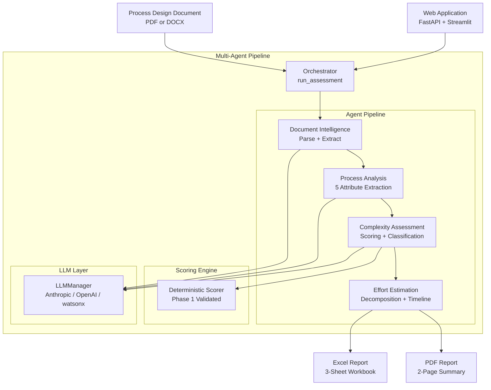

# RPA Complexity Assessment Agent

> Transform a 2–4 hour manual RPA complexity assessment into a sub-10 minute AI-powered workflow

---

## Mission

RPA delivery teams spend 2–4 hours per engagement manually assessing process complexity — reading PDDs, cross-referencing weight matrices, and estimating effort in Excel. This system replaces that workflow with a multi-agent AI pipeline: upload a PDD (PDF or DOCX), and receive a fully scored complexity report with Excel and PDF outputs in under 10 minutes. Built for RPA consultants who need reproducible, auditable assessments at scale.

---

## Architecture



---

## Quick Start

### Prerequisites

- Python 3.11+
- [UV](https://github.com/astral-sh/uv) package manager
- An Anthropic API key (or OpenAI/watsonx)

### Setup

```bash
git clone <repository-url>
cd rpa-complexity-agent
cp .env.example .env
# Edit .env and add your ANTHROPIC_API_KEY
uv sync
```

### Run

```bash
# Start API + Frontend together (recommended)
./run-frontend.sh
```

Access:

- **Frontend**: <http://localhost:8502>
- **API**: <http://localhost:8000>
- **API Docs**: <http://localhost:8000/docs>

### Run Services Separately

```bash
# Start API (Terminal 1)
uv run uvicorn api.main:app --reload --port 8000

# Start Frontend (Terminal 2)
uv run streamlit run frontend/app.py --server.port 8502
```

---

## How It Works

### The 5 Complexity Attributes

Derived from the industry-standard RPA complexity matrix:

| # | Attribute | XS | S | M | L | XL |
| - | --------- | -- | -- | -- | -- | --- |
| 1 | **Activities** | <10 | <10 | 11–20 | 21–40 | 41–60 |
| 2 | **Business Rules** | 0 | 0 | 1–2 | 3–4 | 5–6 |
| 3 | **Digital Layouts** | 1 | 1 | 2–3 | 4–6 | 7–10 |
| 4 | **Target Interfaces** | 1–2 | 1–2 | 3–4 | 5–6 | 7–8 |
| 5 | **Add. Technology** | 0 | 0 | 1 | 2–3 | 4–5 |

### Scoring Example (Ground Truth Validated)

```text
Input PDD: SAP Authorization Management Automation

Extracted:  Activities=52 → XL(8)  Business Rules=6 → XL(8)
            Layouts=5 → L(3)       Interfaces=2 → S(1)
            Technology=0 → S(1)

Total Score: 21/28 → Complexity: L (Large)
Effort:      60 days / 6 two-week sprints
```

### Agent Pipeline

1. **Document Intelligence** — Parses PDF/DOCX, identifies sections, extracts named entities
2. **Process Analysis** — Extracts all 5 attribute raw values using LLM with domain-specific prompts
3. **Complexity Assessment** — Runs deterministic scoring engine, generates AI reasoning narrative
4. **Effort Estimation** — Decomposes process steps, builds delivery timeline, generates Excel + PDF outputs

---

## Configuration

### Environment Variables

| Variable | Required | Description |
| -------- | -------- | ----------- |
| `ANTHROPIC_API_KEY` | If using Anthropic | Anthropic API key |
| `OPENAI_API_KEY` | If using OpenAI | OpenAI API key |
| `DEFAULT_LLM_PROVIDER` | No (default: anthropic) | LLM provider |
| `DEFAULT_LLM_MODEL` | No | Model name override |
| `WATSONX_API_KEY` | If using watsonx | IBM watsonx API key |
| `WATSONX_URL` | If using watsonx | watsonx endpoint URL |
| `LOG_LEVEL` | No (default: INFO) | Logging verbosity |

### Supported RPA Platforms

- Blue Prism
- UiPath
- Power Automate (Desktop + Cloud)
- Automation Anywhere 360

---

## Testing

```bash
# Run all unit tests (no API calls)
uv run pytest tests/ -v -m "not integration"

# Run ground truth validation
uv run pytest tests/integration/test_ground_truth.py -v -s

# Run full integration tests (requires LLM API key)
uv run pytest tests/integration/ -v -m "integration" -s
```

### Test Coverage

| Component | Tests | Status |
| --------- | ----- | ------ |
| Data models & enums | 139 | ✅ |
| Scoring engine | 291 | ✅ |
| LLM abstraction | ~60 | ✅ |
| Document tools | ~80 | ✅ |
| Analysis tools | ~160 | ✅ |
| Scoring tools | ~54 | ✅ |
| Output tools | ~100 | ✅ |
| Orchestration | ~30 | ✅ |
| API | 26 | ✅ |
| Frontend | 22 | ✅ |
| Validation | ~29 | ✅ |
| **Total** | **1045+** | ✅ |

---

## Project Structure

```text
rpa-complexity-agent/
├── core/           # Pure business logic (no framework deps)
│   ├── scoring/    # Deterministic weight matrix + classifier
│   └── models/     # Pydantic data models
├── agents/         # LangGraph agent definitions
├── tools/          # Single-responsibility tool functions
├── llm/            # Multi-provider LLM abstraction
├── api/            # FastAPI backend
├── frontend/       # Streamlit web application
├── data/
│   ├── reference/  # Scoring matrix JSON (source of truth)
│   └── templates/  # Excel workbook template
├── tests/          # 1045+ tests
└── STARTUP.md      # Detailed startup guide
```

---

## Key Design Decisions

**1. Deterministic Scoring Engine**
The core scoring logic (weight matrix, classifier, effort table) is pure Python — zero LLM involvement. This guarantees reproducible results and was validated against the Excel workbook ground truth.

**2. LLM for Extraction, Not Scoring**
LLMs are used only where semantic understanding is needed: document parsing, entity extraction, and reasoning narratives. They never influence the final score.

**3. Multi-Provider LLM Abstraction**
A single `LLMManager` routes all calls. Switching from Anthropic to IBM watsonx requires one environment variable change — no code changes.

**4. Fail-Graceful Architecture**
Every agent node is independently recoverable. A failed entity extraction returns empty results — it doesn't crash the pipeline. Partial results are always better than no results.

---

## Known Limitations

- LLM extraction accuracy varies with PDD quality (well-structured PDDs produce better results)
- Scanned PDFs without OCR text are not supported
- Maximum 60 activities can be scored (XL ceiling)
- Session state is in-memory (resets on API restart)

---

## Roadmap

- [ ] OCR support for scanned PDFs
- [ ] Persistent session storage (PostgreSQL)
- [ ] Batch assessment (multiple PDDs)
- [ ] Historical comparison dashboard

---

## License

MIT License — See LICENSE file
